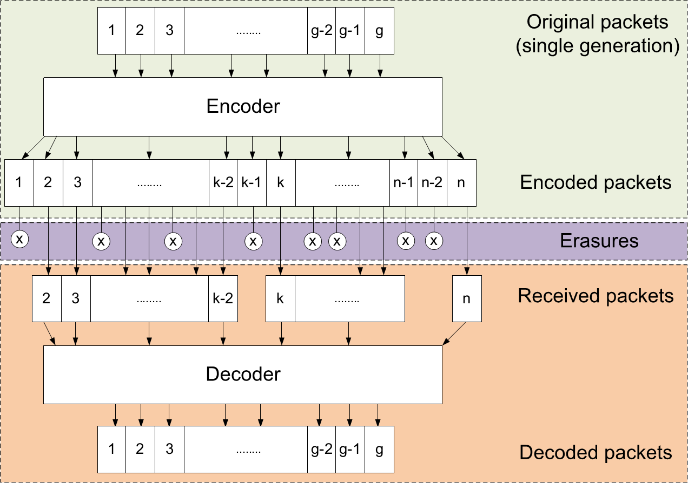

Introduction to Network Coding
==============================

.. _nc_intro:

This page provides background information and useful guidelines about
using Network Coding in common communication scenarios.

What is Network Coding?
-----------------------

Network coding is an interesting technique which can provide throughput
improvements and a high degree of robustness in packet networks.
It breaks with the "store-and-forward" principle of conventional
communication networks by allowing any network node to recombine several
input packets into one coded packet, instead of simple forwarding.

Overview of Random Linear Network Coding (RLNC)
~~~~~~~~~~~~~~~~~~~~~~~~~~~~~~~~~~~~~~~~~~~~~~~

The figure below gives a basic overview of the operations performed in a
network coding system. If you intend to encode a large file then it should
be split into several blocks, also called generations each consisting
of **g** symbols. If the whole file was considered one big block, then the
computational complexity of the encoding and decoding operations would
be very high.

The top component in the figure is the **encoder** that
generates and transmits linear combinations of some original symbols
in a given generation. Addition and multiplication are performed over
a Galois field, therefore a linear combination of several symbols will
have the same size as a single symbol.
Note that any number of encoded packets can be generated for a single
generation.
The middle layer in this system is the wireless **channel** where packet
erasures may occur depending on the channel conditions. The network
nodes receive a series of encoded packets that are passed to the
**decoder** (the bottom component in the figure) which will be able to
reconstruct the original symbols after receiving at least *g*
linearly independent packets.

Scenarios
---------

Network coding is useful for ensuring reliability and/or increasing
throughput in a communication network.
An obvious benefit of using network coding is that a network node is
no longer required to gather all data packets one-by-one, instead it
only has to receive enough linearly independent encoded packets.

Point-to-point Communication
~~~~~~~~~~~~~~~~~~~~~~~~~~~~

Network Coding can be used to repair packet losses on a lossy link,
just like any other Erasure Correcting Code. If a good estimate is
available about the Packet Error Probability, then a certain amount
of redundancy packets can be generated pro-actively to combat packet
losses. This is known as Forward Error Correction (FEC) or simply
"overshooting".

Another approach is to repair packet losses retro-actively which
typically requires some feedback from the receiver about the
lost packets. Of course, the sender could simply retransmit the original
packets without any coding. Network Coding helps in reducing the
necessary feedback from the receiver, because it does not have to
communicate which packets were lost, just how many. The sender can
simply generate and send as many coded packets as the number of packets
lost on the receiver.

Reliable Multicast
~~~~~~~~~~~~~~~~~~

Let's assume that we want to reliably transmit some data from a mobile
device or computer on the network to several nearby receivers via a
lossy wireless link.
The problem is that unicast transmissions provide a poor utilization of the
available network resources for one-to-many scenarios.
If all receivers are interested in the same content, we can efficiently
utilize the wireless channel with broadcast transmissions.

Under ideal channel conditions all broadcast packets would be delivered to
all nodes simultaneously. In real-life wireless networks packet losses
frequently occur, thus some sort of retransmission scheme is necessary to
ensure reliability. We need to correct packet losses at the receivers.
A simple solution would be that the receiver nodes request all missing
packets from the original source. This would imply that every lost packet
is transmitted again, and if packet losses are uncorrelated then most
retransmissions will not be useful to specific receivers since they have
already received those packets in the first place.
To put it differently, it is likely that a single retransmission will
only benefit a single receiver.

By using Network Coding, we can simultaneously benefit
multiple nodes with a single retransmission by sending a coded packet
instead of choosing a specific original packet.
Due to the uncorrelated nature of packet losses, the receivers usually hold
different sets of packets. The source can create and send random linear
combinations of the original data. One coded packet
carries information which can potentially correct different errors at
different nodes simultaneously.

Best-Effort Multicast
~~~~~~~~~~~~~~~~~~~~~

Sometimes reliable data distribution is not a requirement or it is not
possible at all. For example, consider video streaming to a large number
of receivers on a wireless network where feedback would be impractical.
In this case, Network Coding can help to maximize the impact of each
retransmission to the receivers. Ideally, a number of redundancy packets
should be transmitted for each generation to provide a sufficient
degree of reliability for the majority of receivers. This redundancy
ratio (also known as "overshoot") should be adjusted according to the
estimated Packet Error Probability.

Recoding and Multi-hop Networks
~~~~~~~~~~~~~~~~~~~~~~~~~~~~~~~

If the network nodes are constantly moving or if they are connected in a
multi-hop fashion (where some devices can only be reached over multiple hops),
then Network Coding offers even greater benefits due to the unique ability of
recoding. This feature essentially allows all network nodes to generate new
”re-encoded” packets, thus new linear combinations of the packets that they have
previously received. A sender can transmit recoded packets from partially
decoded generations. In contrast, traditional end-to-end coding schemes require
the original data set to be fully decoded before it can be encoded again.

In a multi-hop network, the individual nodes have limited or no information
about the state of other devices, especially if those are several hops away.
Even a small amount of coding operations can substantially increase the number
of innovative transmissions as opposed to just re-transmitting the packets
received from other nodes. A coded packet can contain new information with a
high probability. If recoding is also enabled, then new recoded packets can be
generated even before a generation is completely received. In general, Random
Linear Network Coding helps to minimize signaling between two communicating
devices as the random combinations provide an implicit solution for
coordination.